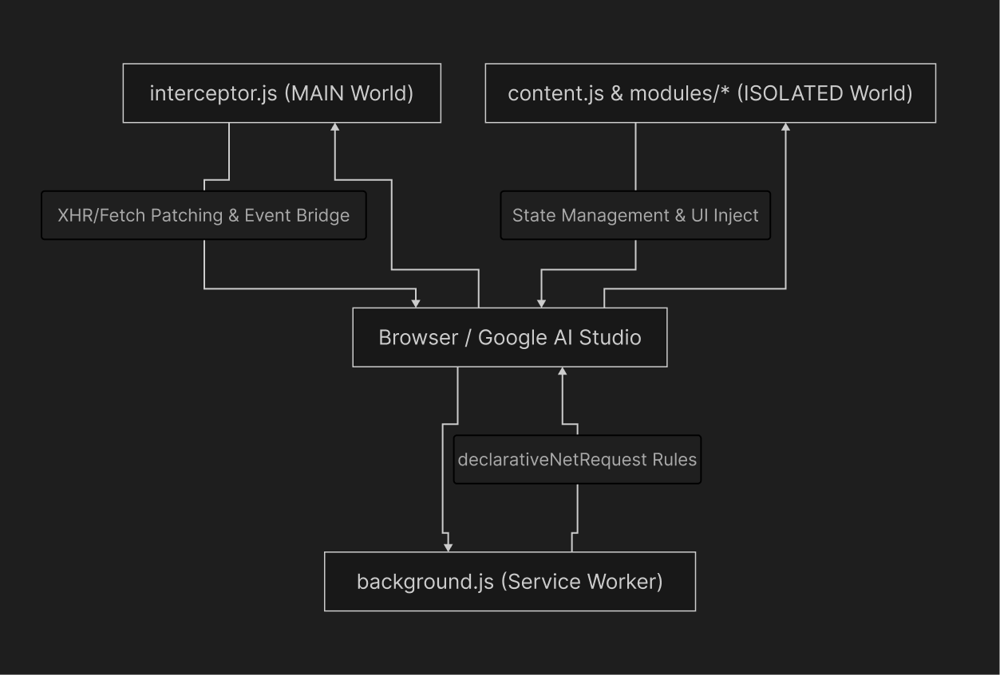
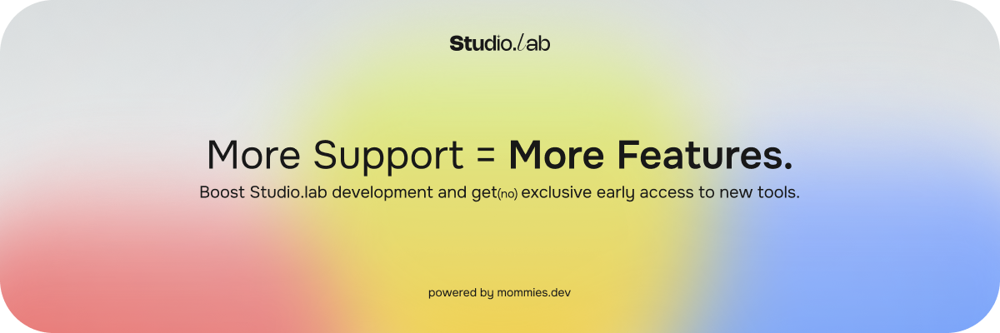

# Studio.lab

An unofficial performance optimizer and content bypass extension for Google AI Studio. 

Studio.lab resolves critical platform limitations—such as client-side content filter aborts and DOM memory leaks—by intercepting network requests before framework initialization and implementing custom memory management routines. This transforms Google AI Studio into a highly stable environment for long-context workflows.

## Features & Version History

All features, including bypass mechanisms, DOM virtualization, UI improvements, and telemetry blocking, are tracked and documented in the changelog.

👉 **[See CHANGELOG.md](CHANGELOG.md) for a complete list of features and version history.**

## System Architecture

The extension operates without build tools or external dependencies. It relies on a decoupled architecture where a core shell orchestrates isolated feature modules.

*   **`interceptor.js`**: Operates in the `MAIN` world context. Injected at `document_start` to patch `XMLHttpRequest` and `fetch` before the host application initializes. It handles telemetry blocking, payload spoofing, and abort neutralization.
*   **`content.js`**: Operates in the `ISOLATED` world. Functions as the primary controller. It handles state persistence, injects the native-styled control panel into the host sidebar, and triggers the module lifecycle inside safe error boundaries.
*   **`sl-panel.css`**: Contains CSS variable mappings and structural classes designed to perfectly match the host application's native design system.
*   **`modules/`**: Contains self-contained, domain-specific logic. Each file evaluates independently and registers a configuration object with the central `registry.js`.

## Installation

1. Clone or download the source code of this repository.
2. Open your Chromium-based browser and navigate to `chrome://extensions` (or `edge://extensions`).
3. Toggle **Developer mode** in the top right corner.
4. Click **Load unpacked** and select the extracted project directory.
5. Navigate to or refresh `aistudio.google.com`. The Studio.lab configuration panel will be accessible in the right sidebar below the System Instructions module.

## Privacy and Security

Studio.lab is built with strict adherence to local-only execution:
*   Zero external dependencies, trackers, or analytics.
*   Zero outbound network requests.
*   State is maintained exclusively via local browser storage.
*   The source code is provided completely unobfuscated for comprehensive security auditing.

## Support

Please note that this extension is an **unofficial modification** and is not affiliated with, endorsed by, or connected to Google LLC. As a community-driven project, we do not have a dedicated official support team.

### Getting Help with Studio.lab

If you encounter bugs, have feature requests, or need help specifically regarding this extension:

1. **Follow the Updates on Reddit:** We regularly post news, updates, and release notes on the [r/GoogleAIStudio](https://www.reddit.com/r/GoogleAIStudio/) subreddit. 
2. **Ask in the Comments:** The best way to reach out for support or suggest an idea is to leave a comment under our latest update posts on the subreddit. The community and the developer will be happy to help!
3. **GitHub Issues:** You can also open an issue directly in this repository if you prefer to report technical bugs or contribute to the codebase.

### Getting Help with Google AI Studio

If you are experiencing general issues with the Google AI Studio platform itself (e.g., API keys, model behaviors, billing) that are **not** related to this extension:

* **Official Support:** Please refer to the official [Google AI Studio Documentation](https://ai.google.dev/aistudio) or contact Google's official support channels.
* **Community Help:** You can also ask for advice and troubleshooting tips from the community on [r/GoogleAIStudio](https://www.reddit.com/r/GoogleAIStudio/).

### Support the Development

If this extension ensures your workflow continuity and mitigates data loss, consider supporting the development through Ko-Fi. 

---
*Disclaimer: Studio.lab is an unofficial modification. It is not affiliated with, endorsed by, or connected to Google LLC or Google AI Studio.*
